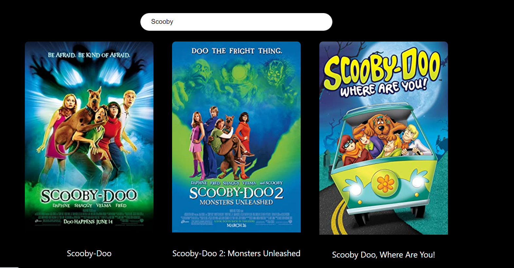

# Movie App

This is a React application where we can search for movies and the details with help of OMDb API.

# Getting Started 🏁
These instructions will get you a copy of the project up and running on your local machine for development purpose.

# Prerequisites
IDE: VSCode 

Node: https://nodejs.org/en/download/ 

# How To Setup
Clone the repository and Run below on your local in the home directory of the app so as to get the required dependencies.
### `npm install`

# Project start
Launch application with below command.
### `npm start`

# Home Page

  

# Detail Page

  

# Choices made
Used axios for fetching response from the api and route-router-dom for routing purpose
Separated style files, components, pages, and Context files for Separation of Concern and to make it more generic.
